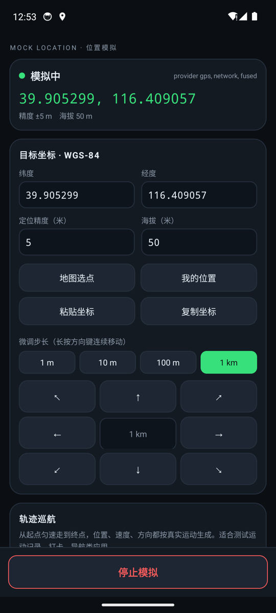

# 位置模拟 · Mock Location

一个只干一件事的安卓小工具：**把手机的位置改到你指定的地方**，或者让它沿一条直线匀速"走"过去。
改完之后，其他应用（地图、打卡、运动记录、导航测试……）读到的就是这个位置。

全部逻辑都在本机完成，没有服务器、没有账号、不采集任何数据。唯一的联网行为是地图选点页
去拉底图瓦片，所以**不打开地图就完全不联网**。

| | |
|---|---|
| 包名 | `com.sideproject.mocklocation` |
| 系统要求 | Android 7.0（API 24）及以上 |
| 体积 | 约 680 KB |
| 依赖 | 只有 androidx appcompat / core-ktx，没有第三方 SDK |



## 安装

到 [Releases](https://github.com/gamedirty/mock-location/releases/latest) 下载
`mock-location.apk`，拷进手机点安装，允许"未知来源应用"即可。

## 用之前必须先授权（否则一定失败）

安卓只允许**被系统选中**的应用伪造位置，所以第一次用要做两件事：

1. **打开开发者选项**：设置 → 关于手机 → 连点「版本号」7 次
   （小米/红米在「全部参数」里连点 MIUI 版本；华为在「关于手机」连点版本号）
2. **设置 → 系统 → 开发者选项 → 选择模拟位置信息应用 → 选「位置模拟」**
3. 首次打开应用时允许它获取位置信息

没做完这两步就点「开始模拟」，应用会弹出提示并直接带你跳到开发者选项。
应用顶部也会一直显示一条黄条提醒，授权完成后自动消失。

> 找不到「选择模拟位置信息应用」？部分国产 ROM 把它藏在开发者选项靠下的位置，
> 用设置里的搜索框搜"模拟"更快。

## 功能

**目标坐标**
- 直接输入经纬度（WGS-84），可调定位精度与海拔——精度会影响依赖它的应用怎么判断你在哪
- **地图选点**：内置底图，点击地图上任意位置即可取坐标（见下面「坐标系」一节）
- **我的位置**：读一次手机真实定位作为起点，适合"就在这儿附近微微挪一下"的场景
- **粘贴 / 复制坐标**：从聊天记录、文档里粘 `39.904200,116.407400` 这种格式都能认出来
- **方向键微调**：8 个方向 + 1 m / 10 m / 100 m / 1 km 四档步长，单击走一格，
  **长按连续移动**，用来做几十米的精细对位很方便

**轨迹巡航**
- 设起点、终点，选速度（0.1–30 m/s，约 0.4–108 km/h），点开始
- 位置、速度、方向角都按真实运动生成：每秒推进一次，方位角按航向算，速度和精度跟着一起给
- 可循环，也可以到终点停下
- 用来测运动记录、打卡、轨迹回放这类应用比手动改坐标靠谱得多

**其他**
- 收藏常用地点，一键切换；每条都能直接设为巡航起点/终点
- 前台服务 + 通知栏常驻，**退到后台、锁屏都继续生效**，通知栏实时显示当前坐标，带「停止」按钮
- 运行日志：每次操作、每次授权状态变化都有记录，出问题先看这里
- 再打开应用会自动恢复上次的坐标、步长、速度、收藏

**停止**：点底部的「停止模拟」，系统里的模拟 provider 会被移除，位置立刻交还真实 GPS。

## 坐标系（容易踩的坑）

应用内部**统一用 WGS-84**，也就是手机 GPS 芯片输出的那一套，和真实定位同一基准。

但国内地图的底图是 **GCJ-02**（国测局坐标，高德/腾讯在用），和 WGS-84 在国内相差
**50~700 米**（北京约 550 米）。如果直接把地图上点到的坐标灌进模拟位置，实际位置会
整体偏出去几百米。所以：

- 底图选**高德（GCJ-02）**：选完自动换算成 WGS-84，面板上会显示这次换算的偏移量
- 底图选 **OSM（WGS-84）**：本身就是 WGS-84，不做换算（国内直连很慢，国外或挂梯子时用）

手动输入的坐标永远按 WGS-84 解释。

## 从源码构建

```
tools/gradle-8.7/bin/gradle.bat :app:assembleRelease
```

`local.properties` 里写你们的 SDK 路径：

```
sdk.dir=C:/Users/yourname/AppData/Local/Android/Sdk
```

Release 签名读 `keystore/keystore.properties`（已 gitignore）；没有这个文件时会退回
debug 签名，克隆下来照样能装。依赖走阿里云镜像 + google/mavenCentral（见 `settings.gradle.kts`）。

## 实现要点

- `MockEngine.kt`：核心。通过 `LocationManager.addTestProvider` + `setTestProviderLocation`
  每秒把位置灌给系统。**同时模拟 `gps` / `network` / `fused` 三个 provider**——
  老应用和游戏读前两个，Android 12+ 上 Google 融合定位认 `fused`，只模拟一个经常不生效。
  每个 provider 的位置单独构造，精度/海拔/速度/方向都带轻微抖动，避免出现"死值"特征。
- `MockService.kt`：前台服务（`foregroundServiceType="location"`），负责让进程活着 + 通知栏。
  心跳循环本身在引擎里，服务挂了也不影响前台使用（会自动降级）。
- `CoordTransform.kt`：WGS-84 ⇄ GCJ-02 互转（反解用一次迭代，误差 < 1 米）。
- `assets/map.html`：地图选点页的底图是手写的 slippy map（约 300 行原生 JS + OSM/高德瓦片），
  不依赖任何在线 JS 库。踩过的两个坑写在代码注释里：一是世界坐标是千万级大数，
  直接写进 DOM 会被浏览器布局精度截断（必须转成屏幕坐标），二是 WebView 首次回调时
  视口尺寸可能还没算出来（用 `ResizeObserver` 兜底）。

## 常见问题

**点了开始模拟，位置没变？**
1. 看应用顶部有没有黄条——有就是没被选为模拟位置应用
2. 目标应用可能缓存了上次定位，杀掉重开；部分应用要等下一次定位刷新（几十秒）
3. 系统定位开关要打开
4. 看日志区的 provider 列表，正常应该是 `gps, network, fused`

**地图底图加载不出来？**
地图选点页的提示条会告诉你。底图走的是在线瓦片，网络不通时就是一片深灰底色——
不影响选点逻辑（点击依然能取到坐标），也可以直接用方向键微调。

**QQ/微信/某打卡软件还是显示真实位置？**
一部分应用会检测模拟位置（`Location.isMock`）或做环境校验。这个应用不做任何规避，
它用的是系统公开的调试接口，被检测到是正常现象。

**耗电吗？**
静止时每秒推一次位置，前台服务常驻，耗电和常驻通知的普通应用差不多。不用了记得点停止。

## 说明

模拟位置是安卓系统提供给开发者调试用的公开能力（开发者选项里的那项），本应用只是给它做了个
好用的界面。请把它用在调试、测试、隐私保护的场景上，不要用于打卡作弊、刷单、伪造行程等
违规用途——那类场景通常也有反作弊检测，被判定异常后果自负。
